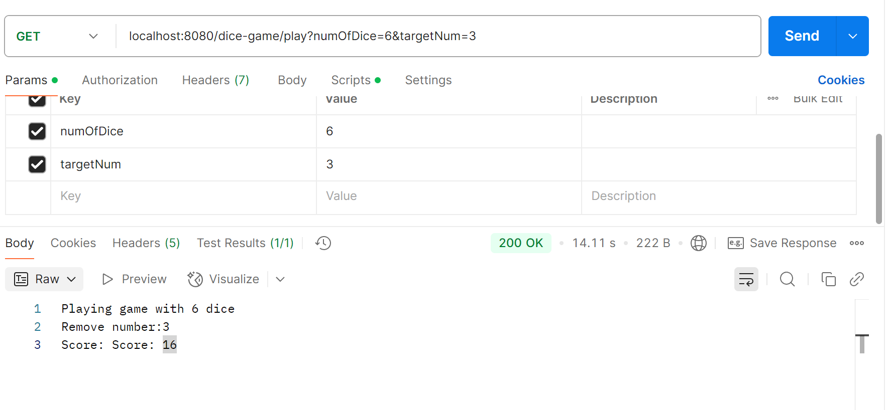
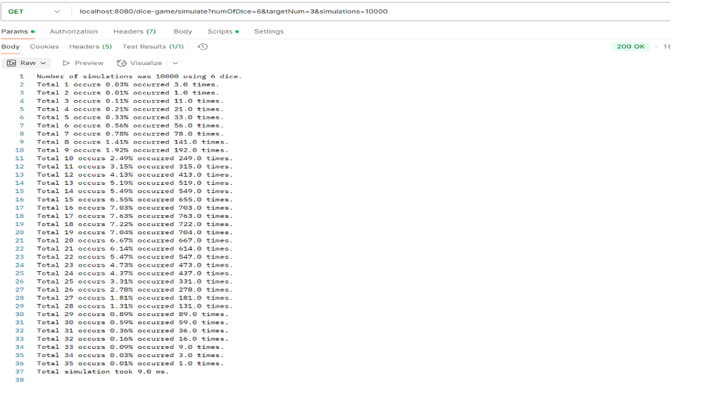

# dice-game

Simulation of a dice game

Two solutions are provided for the game.

<strong>Solution (1) is plain java:  </strong>

<pre>
cd demo-dice-game/src/main/java
javac DiceGameSimulator.java
java DiceGameSimulator 5 3 10000
</pre>

Sample output:
<pre>
Number of simulations was 10000 using 5 dice.
Total 0 occurs 0.00 occurred 2.0 times.
Total 1 occurs 0.00 occurred 4.0 times.
Total 2 occurs 0.00 occurred 16.0 times.
Total 3 occurs 0.00 occurred 37.0 times.
Total 4 occurs 0.01 occurred 64.0 times.
Total 5 occurs 0.01 occurred 106.0 times.
Total 6 occurs 0.01 occurred 129.0 times.
Total 7 occurs 0.02 occurred 231.0 times.
Total 8 occurs 0.03 occurred 319.0 times.
Total 9 occurs 0.04 occurred 407.0 times.
Total 10 occurs 0.05 occurred 487.0 times.
Total 11 occurs 0.05 occurred 536.0 times.
Total 12 occurs 0.07 occurred 681.0 times.
Total 13 occurs 0.08 occurred 751.0 times.
Total 14 occurs 0.08 occurred 800.0 times.
Total 15 occurs 0.08 occurred 763.0 times.
Total 16 occurs 0.07 occurred 749.0 times.
Total 17 occurs 0.08 occurred 766.0 times.
Total 18 occurs 0.07 occurred 741.0 times.
Total 19 occurs 0.06 occurred 575.0 times.
Total 20 occurs 0.05 occurred 496.0 times.
Total 21 occurs 0.04 occurred 409.0 times.
Total 22 occurs 0.03 occurred 289.0 times.
Total 23 occurs 0.03 occurred 254.0 times.
Total 24 occurs 0.02 occurred 155.0 times.
Total 25 occurs 0.01 occurred 111.0 times.
Total 26 occurs 0.01 occurred 64.0 times.
Total 27 occurs 0.00 occurred 37.0 times.
Total 28 occurs 0.00 occurred 17.0 times.
Total 29 occurs 0.00 occurred 4.0 times.
Total simulation took 28.0 ms.

</pre>
<strong>Solution (2) provides 2 rest api</strong>
<pre>
To run the spring boot application:
Goto the demo-dice-game folder:
mvn clean install
java -jar  target/demo-dice-game-0.0.1-SNAPSHOT.jar

one can play a game by calling:
Parameters: numOfDice - number of dice used
            targetNum - the number to be removed
- http://localhost:8080/dice-game/play?numOfDice=6&targetNum=3

Sample play game output:
</pre>

<pre>
One can do the simulation by calling:
- http://localhost:8080/dice-game/simulate?numOfDice=6&targetNum=3&simulations=10000

Sample simulation output:
</pre>

